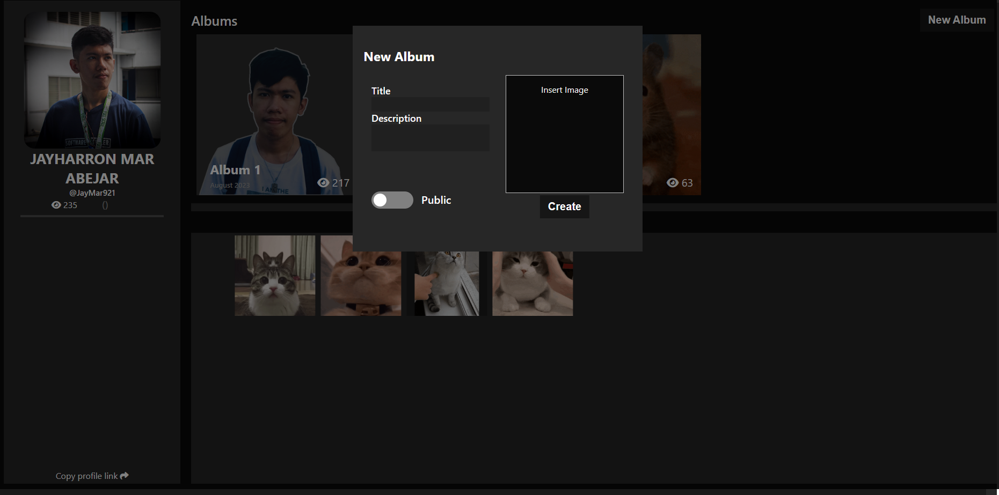
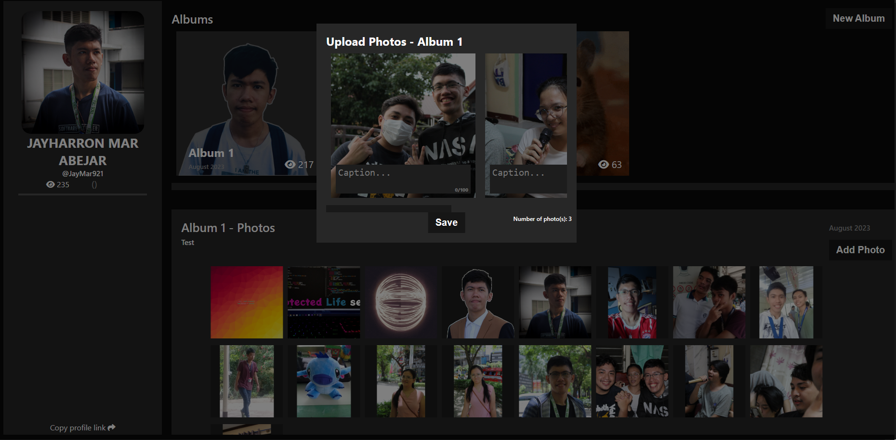
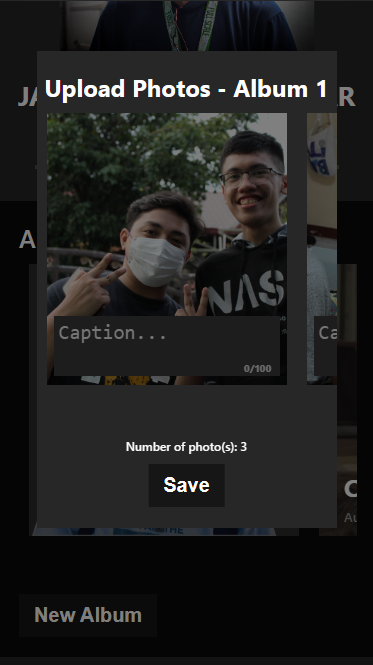
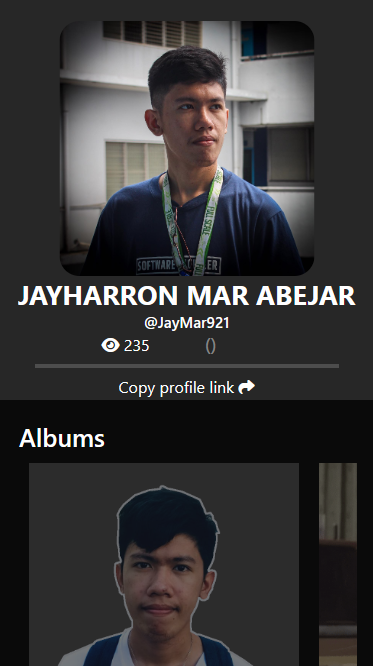

# PhotoLib
> Created by [Jayharron Mar Abejar](https://jayharronabejar.info)

PictoLib - An online repository for digital art creators and photographers
### Run the app
To run the application, open the project folder where `docker-compose.yml` is located. Open your terminal and enter the command below
```
docker-compose up
```
The UI design was created here [Figma link](https://www.figma.com/file/i5lkwBlmqfUhgSMp3QxCD2/Photography-Library?type=design&node-id=0%3A1&mode=design&t=0fMkfCEKCpTLHtsn-1)

## Technology Stacks
- ASP.NET C#
- ReactJS
- SQLite
- Docker

## Sample Output
#### Create new album [Desktop]

#### Upload a photo in specific album [Desktop]


#### Mobile Responsive


